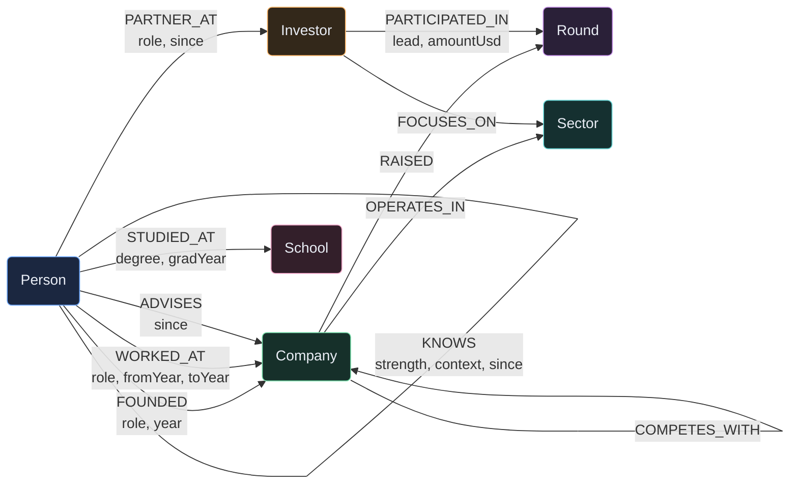
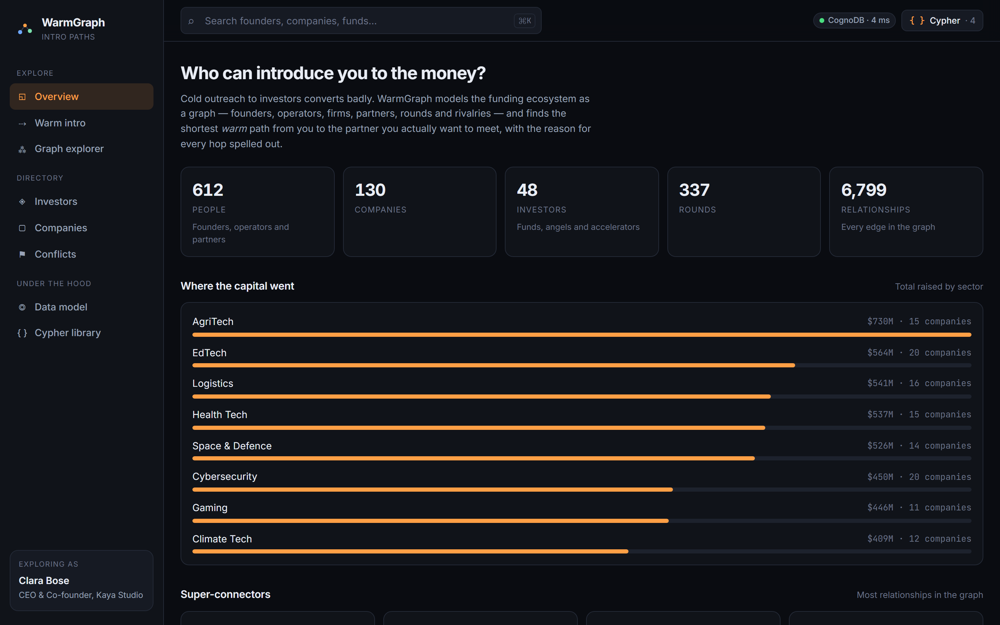
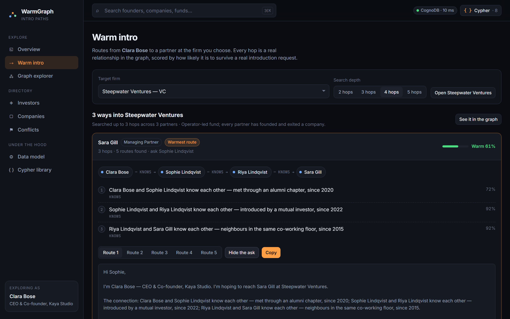
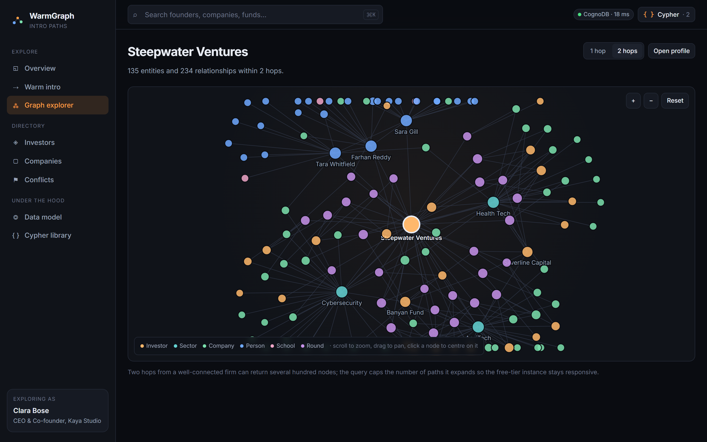
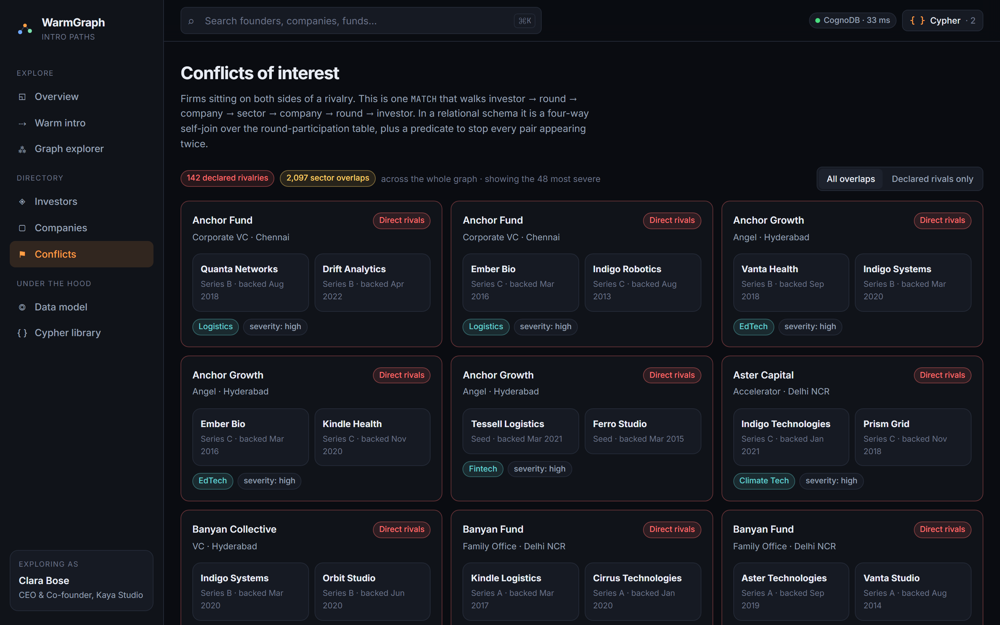
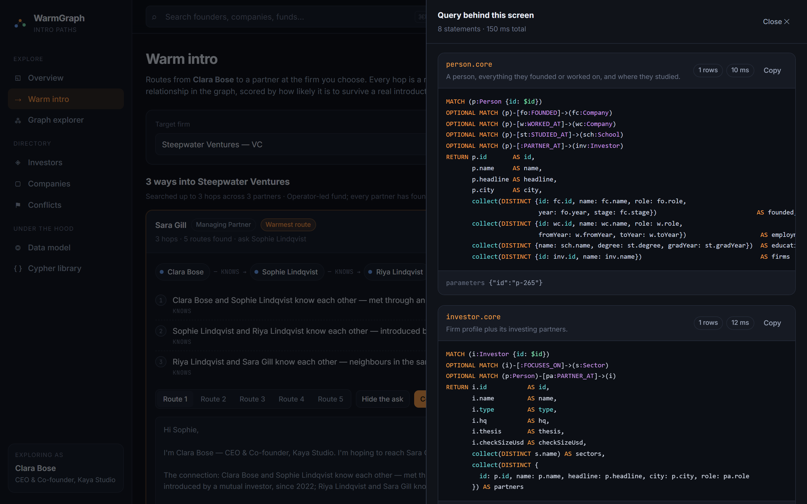
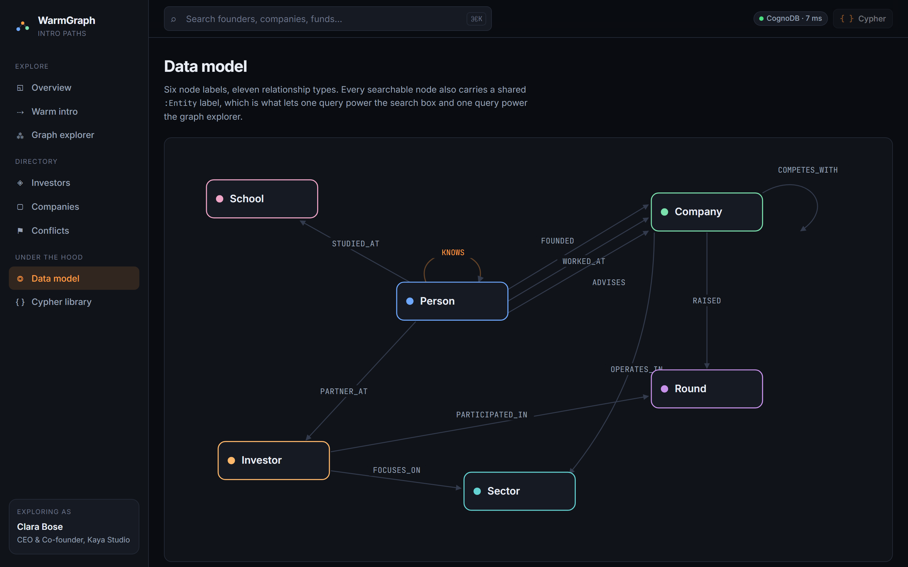

# WarmGraph

**The shortest warm path from a founder to the investor they want to reach.**

Built on [CognoDB](https://console.cognodb.com) — openCypher over Bolt, via the official Neo4j driver.

| | |
|---|---|
| **Live demo** | **<https://warmgraph.vercel.app>** |
| **Repository** | <https://github.com/GurpreetDel/warmgraph> |
| **Screen recording** | _add your Loom/YouTube link here_ |
| **Stack** | React 18 + Vite + TypeScript · Node serverless API · CognoDB (graph) |

---

## 1. The problem

Cold outreach to investors converts at roughly nothing. Warm introductions convert. Every founder knows this, and every founder still ends up staring at a fund's website wondering *"do I know anyone who knows anyone here?"*

That question is not a lookup. It is a **path search over a network of people** — and the network is the interesting part, not the records. WarmGraph models a startup funding ecosystem as a graph and answers three questions a founder actually has:

1. **How do I reach this firm?** Ranked introduction routes to every partner, with the reason for each hop written out in plain English and a warmth score attached.
2. **Who should I even be talking to?** Firms whose stated thesis matches what you are building *and* who have already written cheques at the stage you are raising.
3. **Who is already funding my competition?** Firms sitting on both sides of a rivalry — the thing you want to know *before* the meeting, not after.

There is a fourth audience the same graph serves: an LP or a journalist asking "which funds keep showing up on the same cap tables, and where are the conflicts?"

## 2. Why a graph database?

The core query is *"what is the shortest credible chain of people between me and a partner at this firm?"* — a **variable-length path search**. That is the case where a graph database is not a stylistic preference:

**In SQL, the number of joins depends on the answer.** You cannot write the query until you know how many hops it takes. The options are a recursive CTE (slow, near-unreadable, and awkward to constrain to a mixed set of relationship types) or a fixed join depth that silently misses every longer route. Both get worse the moment you want to traverse `KNOWS`, `WORKED_AT`, `FOUNDED` and `STUDIED_AT` in a single walk, because those are four different tables with four different shapes.

**In Cypher the hop count is part of the pattern:**

```cypher
MATCH path = (me)-[:KNOWS|WORKED_AT|FOUNDED|STUDIED_AT|ADVISES|PARTNER_AT*1..4]-(partner)
```

One line, four relationship types, any depth. Traversal cost is proportional to the neighbourhood actually explored — not to the size of the tables.

Three more places the graph earns its keep here:

- **Conflict detection is a six-hop pattern in one `MATCH`.** `investor → round → company → sector → company → round → investor`. The relational equivalent is a four-way self-join over the round-participation table plus a de-duplication predicate so each pair does not appear twice. See [`conflicts.sameSector`](#5-the-queries-that-matter).
- **Rounds are a hyperedge.** One round connects one company to *many* investors, each with their own cheque size and lead flag. As a node with typed edges this is natural; in SQL it is a junction table you re-join every time you ask anything interesting.
- **The model absorbs change.** Adding `MENTORS` or `SERVED_ON_BOARD` is a new relationship type plus one more name inside the traversal. No migration, no rewritten joins, and every existing path query gets richer for free.

Where a relational database would still win: the aggregate reporting (capital by sector, rounds by stage). Those are honest `GROUP BY`s and Cypher is no better at them. The app does both — which is the point. You pick the store for the questions that are hard, not the ones that are easy.

## 3. Data model

Six node labels, eleven relationship types. Every searchable node also carries a shared `:Entity` label — that single decision is what lets **one** query power the global search box and **one** query power the graph explorer, instead of four of each.



> The same diagram is rendered inside the app at **Data model** (`#/model`), annotated with why each label exists.

### Node labels

| Label | Properties | Why it exists |
|---|---|---|
| `Person` | `id, name, headline, city, isPersona` | Founders, operators and investing partners share one label. That is what lets a single traversal cross from a founder, through a former colleague, into a fund. |
| `Company` | `id, name, city, stage, foundedYear, description, website, headcount` | Doubles as a connector — two people who worked at the same company are two hops apart with no explicit edge between them. |
| `Investor` | `id, name, type, hq, thesis, checkSizeUsd` | The firm, not the human. You raise from a firm but you get introduced to a person; modelling both is what makes the intro engine work. |
| `Round` | `id, stage, amountUsd, announcedOn, valuationUsd` | A node, not an edge, because it joins one company to many investors. As a relationship it could only ever connect two things. |
| `Sector` | `id, name` | Shared by companies (what they do) and investors (what they will fund). That shared node *is* the conflict-of-interest query. |
| `School` | `id, name` | The weakest tie we model, and scored accordingly. |

### Relationship types

| Type | From → To | Properties | Note |
|---|---|---|---|
| `KNOWS` | Person → Person | `strength, context, since` | Stored once, traversed undirected. |
| `FOUNDED` | Person → Company | `role, year` | Two people who founded the same company are co-founders — the strongest tie in the graph. |
| `WORKED_AT` | Person → Company | `role, fromYear, toYear` | The years matter: a shared employer only counts if they overlapped. |
| `STUDIED_AT` | Person → School | `degree, gradYear` | Same reasoning — a shared campus twelve years apart is not a connection. |
| `ADVISES` | Person → Company | `since` | Lighter than founding, and scored below it. |
| `PARTNER_AT` | Person → Investor | `role, since` | The bridge from the people graph into the capital graph. |
| `RAISED` | Company → Round | — | Exactly one company per round. |
| `PARTICIPATED_IN` | Investor → Round | `lead, amountUsd` | Many investors per round; the cheque size and lead flag live on the edge, where they belong. |
| `OPERATES_IN` | Company → Sector | — | A company can sit in more than one. |
| `FOCUSES_ON` | Investor → Sector | — | The firm's stated thesis, used to rank recommendations. |
| `COMPETES_WITH` | Company → Company | — | Declared rivalry. Upgrades a conflict from "worth noting" to "worth a conversation". |

### Dataset size

`npm run seed` loads a deterministic dataset — **1,153 nodes and 6,799 relationships**:

```
Sector 12 · School 14 · Person 612 · Company 130 · Investor 48 · Round 337
FOUNDED 285 · WORKED_AT 1,473 · STUDIED_AT 557 · KNOWS 2,432 · PARTNER_AT 137
PARTICIPATED_IN 1,009 · RAISED 337 · OPERATES_IN 169 · FOCUSES_ON 152
ADVISES 160 · COMPETES_WITH 88
```

Comfortably inside the free `c0` tier (0.5 vCPU, 256 MB, 1 GB disk) while still being dense enough that multi-hop traversals return real, non-trivial answers.

**On the data itself:** it is synthetic but realistic — plausible firms, plausible cheque sizes, plausible career histories, generated from a fixed seed in [`scripts/dataset.ts`](scripts/dataset.ts). That is a deliberate choice, not a shortcut. The app makes assertions about *who knows whom*, and it would be wrong to attach invented relationships to real named people. A fixed seed also means `npm run seed` produces byte-identical data on any machine, so the screenshots below match what you will see.

Two details in the generator are worth flagging because they are modelling decisions, not noise:

- The `KNOWS` network is built as a **small-world graph** — a ring lattice plus random long-range edges. The ring guarantees the network is connected, so a warm path always exists in principle; without it some founders would be unreachable islands and the product's core promise would quietly fail for them. The random edges keep average path length short, the way a real professional network behaves.
- Round participants are drawn from firms whose thesis actually covers one of the company's sectors, so "who backs this space" returns something coherent rather than noise.

## 4. Screenshots

> Captured from the running app with [`scripts/screenshots.mjs`](scripts/screenshots.mjs), so they can be
> regenerated exactly. Because the dataset is generated from a fixed seed, they show the same graph you get.

| | |
|---|---|
|  |  |
| **Overview** — ecosystem stats and the persona picker | **Warm intro** — ranked routes with a narrated chain |
|  |  |
| **Graph explorer** — force-directed neighbourhood | **Conflicts** — firms on both sides of a rivalry |
|  |  |
| **Query behind this screen** — the Cypher that just ran | **Data model** — the schema, annotated |

## 5. The queries that matter

All Cypher lives in one file, [`server/cypher.ts`](server/cypher.ts), as named constants with a stated purpose. The app serves that catalogue at `/api/queries` and renders it at `#/queries` — so the queries you read in the UI are literally the ones that execute.

### Multi-hop traversal — the warm-intro engine

```cypher
MATCH (me:Person {id: $fromId})
MATCH (target:Person)-[:PARTNER_AT]->(firm:Investor {id: $investorId})
MATCH path = (me)-[:KNOWS|WORKED_AT|FOUNDED|STUDIED_AT|ADVISES|PARTNER_AT*3..3]-(target)
WHERE ALL(n IN nodes(path) WHERE size([m IN nodes(path) WHERE m = n]) = 1)
RETURN [n IN nodes(path)         | {labels: labels(n), props: properties(n)}] AS nodeChain,
       [r IN relationships(path) | {type: type(r), props: properties(r),
                                    fromId: startNode(r).id, toId: endNode(r).id}] AS relChain,
       target.id AS targetId
LIMIT $limit
```

Three things to note:

- **The `WHERE ALL(...)` clause enforces node uniqueness.** Cypher guarantees a relationship appears at most once in a path, but *nodes* can repeat — so without this you get routes that bounce off the same person twice and read as nonsense.
- **The traversal widens one hop at a time.** [`server/services/intro.ts`](server/services/intro.ts) runs the 1-hop query, then 2, then 3, stopping as soon as it has enough routes. Shorter paths are warmer, so the first budget that produces results is also the best answer — and we never pay for a five-hop expansion when a two-hop introduction exists. On a burstable 0.5-vCPU instance that is the difference between snappy and unusable.
- **Variable-length bounds cannot be parameterised in Cypher.** Rather than building the pattern by concatenation, there is one *pre-written* constant per hop count in a frozen map, selected by a validated integer. The query text stays constant; only `$fromId`, `$investorId` and `$limit` vary.

Path scoring happens in the application layer, not the query, because it is product judgement rather than data retrieval: a shared employer is worth something only if the two people were actually there at the same time, and an alumni tie is close to noise unless the graduation years line up. Each hop gets a confidence, the path score is their product, and the UI shows both.

### The query a relational database would hate — conflicts of interest

```cypher
MATCH (i:Investor)-[:PARTICIPATED_IN]->(r1:Round)<-[:RAISED]-(c1:Company)-[:OPERATES_IN]->(s:Sector),
      (i)-[:PARTICIPATED_IN]->(r2:Round)<-[:RAISED]-(c2:Company)-[:OPERATES_IN]->(s)
WHERE c1.id < c2.id
OPTIONAL MATCH (c1)-[rivalry:COMPETES_WITH]-(c2)
WITH i, s, c1, c2,
     count(rivalry)      AS rivalryCount,
     min(r1.announcedOn) AS firstDate,
     min(r2.announcedOn) AS secondDate
...
```

Six hops, one `MATCH`, and the `s` variable appearing twice is what ties the two portfolio companies to the *same* sector. The `c1.id < c2.id` predicate stops every pair appearing in both orders. In SQL this is four self-joins over the participation table before you have written a single projection.

### Other queries worth a look

| Query | What it does |
|---|---|
| `investor.coInvestors` | Two hops through `Round` to find which firms keep showing up on the same cap tables. |
| `intro.recommend` | Four hops from *me* to *a firm that funds companies like mine*, ranked by stage fit. |
| `graph.neighbourhood.2` | The 2-hop neighbourhood of any entity, flattened with `reduce` into node and edge lists for the force layout. |
| `search.entities` | One type-ahead across People, Companies, Investors and Sectors — only possible because of the shared `:Entity` label. |
| `stats.topSectors` | Honest aggregation. Included to show the graph does not make ordinary reporting harder. |

### Parameterisation

**Every** value a user controls is a bound parameter. There is no string interpolation into Cypher anywhere in this repo — the query text is a constant and the parameters travel separately to the driver:

```ts
await session.run(cypher, params, { timeout: QUERY_TIMEOUT_MS });
```

The two places where the *statement* varies (hop count, explorer depth) select a pre-written constant from a frozen map using a validated integer, never a concatenated string. Filters that can be "off" use an empty-string sentinel inside the query (`WHERE ($sector = '' OR $sector IN sectors)`) rather than assembling a `WHERE` clause in TypeScript.

You can see all of this for yourself: the **Cypher** button in the top bar of every screen opens a drawer with the exact statements that just ran, their bound parameters, row counts and timings.

## 6. Architecture

```
warmgraph/
├── shared/types.ts           One copy of the wire contract, imported by both sides
├── server/
│   ├── config.ts             Environment loading + validation (never throws)
│   ├── db.ts                 Driver singleton, pooling, error translation
│   ├── errors.ts             ApiError → HTTP status
│   ├── cypher.ts             ★ Every Cypher statement, named, with a purpose
│   ├── execute.ts            Tracer: runs a statement and records what it ran
│   ├── mappers.ts            Neo4j records → domain types
│   ├── routes.ts             The whole API surface, one table of handlers
│   ├── services/             One module per domain concept
│   │   ├── health.ts  stats.ts  directory.ts  investor.ts
│   │   └── company.ts person.ts intro.ts      conflicts.ts  graph.ts
│   └── dev.ts                Local API server (the only file not deployed)
├── api/index.ts              Vercel serverless adapter → server/routes.ts
├── scripts/
│   ├── dataset.ts            Deterministic generator (seeded PRNG)
│   ├── seed.ts               Batched, parameterised UNWIND loader
│   └── verify.ts             Exercises every endpoint against the live instance
└── src/                      React app — components/, pages/, lib/, styles/
```

**Layering.** `routes → services → cypher/db`. A service knows about domain shapes and never touches the driver directly; `db.ts` knows about the driver and nothing about investors. The Vercel handler and the local dev server are two thin adapters over the same `handleApiRequest` — one implementation, two hosts, no drift between what you test locally and what ships.

**Connection reuse.** The driver is cached on `globalThis`, so a warm Vercel invocation reuses the connection pool rather than paying a TLS handshake per request. The pool is capped at 12 connections: the free tier allows 200, and a small pool stops a burst of serverless invocations exhausting the instance.

**Error handling.** Driver failures are translated once, in `toApiError`, into a small vocabulary (`DB_UNREACHABLE`, `DB_AUTH_FAILED`, `NOT_CONFIGURED`, `TIMEOUT`, …) with an operator-facing hint attached. The frontend has exactly one error shape to render. `/api/health` deliberately **always** answers `200` with a diagnosis — the moment the database is down is exactly when the UI most needs a usable response — and it distinguishes three failure modes the user can act on:

| State | What the app shows |
|---|---|
| No env vars | "No database configured" + which variables are missing |
| Instance unreachable | "Cannot reach CognoDB" + check the URI / is the instance running |
| Connected, zero nodes | "Connected, but the graph is empty" + run `npm run seed` |

The banner re-checks every 30 seconds and clears itself when the instance comes back.

**Portability.** The queries stay inside the portable openCypher core: no APOC, no GDS, no `shortestPath()`, no `CALL {}` subqueries, no `EXISTS {}`, no `percentileCont` (the median is computed in TypeScript). They run unchanged on CognoDB, Neo4j, or any other openCypher engine. Constraint and index creation in the seed script is **best-effort** — wrapped in try/catch and reported — so an engine that rejects the DDL syntax still gets a fully working dataset.

**UI/UX.** Every screen routes through one `AsyncBoundary` that decides between loading / error / empty / content, which is why the states are consistent everywhere. Loading is skeletons shaped like the content, so the layout does not jump. Empty states offer the next action ("no route within 4 hops → search 5 hops"). The graph layout is computed synchronously and deterministically rather than animated: a settled graph appears instantly instead of writhing for two seconds, and the same subgraph always lays out the same way. Full keyboard support in search (⌘K, arrows, Enter). `prefers-reduced-motion` is respected.

## 7. Running it locally

### Prerequisites

- Node.js 20 or newer
- A CognoDB Cloud account (free, no credit card)

### Step 1 — Create a CognoDB instance

1. Sign up at **<https://console.cognodb.com/signup>**.
2. From the console, create a **free (c0) instance** and pick the region closest to you. It provisions in under a minute. Each workspace gets one free instance.
3. When it finishes, copy the connection details:
   - **URI** — `bolt+s://<instance-id>.databases.cognodb.cloud`
   - **Username** — `cognodb`
   - **Password** — generated, and **shown exactly once**. Copy or download it immediately; if you lose it you will have to rotate it from the console.

### Step 2 — Configure and seed

```bash
git clone <your-repo-url> warmgraph
cd warmgraph
npm install

cp .env.example .env      # then paste your URI and password into .env
npm run seed              # ~1,150 nodes and ~6,800 relationships
npm run verify            # exercises every endpoint against the live instance
```

`.env` is gitignored and is never committed. `npm run seed:reset` wipes the graph first (in bounded batches, so a 256 MB instance does not run out of heap). `npm run seed -- --dry-run` generates and summarises the dataset without connecting to anything.

`npm run verify` is the script to reach for whenever something looks wrong — it runs the same service layer the web app uses, with no browser in the way:

```
Multi-hop traversals
────────────────────
PASS /api/intro?from=p-118&investor=inv-7&maxHops=4 (412 ms)
     best route to Kalpataru Ventures: 3 hops, score 0.5842
       · Ananya Menon and Rohan Iyer know each other — worked together on a launch, since 2019
       · Rohan Iyer was VP Engineering at Zeta Ledger (2018–2022) — they overlapped there
       · Priya Nair is General Partner at Kalpataru Ventures
```

### Step 3 — Run

```bash
npm run dev
```

Vite serves the UI on **<http://localhost:5173>** and proxies `/api` to the local API server on port 3001, so the browser makes the same relative requests it will make in production.

| Script | What it does |
|---|---|
| `npm run dev` | UI + API together |
| `npm run build` | Typecheck and build the production bundle |
| `npm run seed` | Load the dataset (idempotent) |
| `npm run seed:reset` | Wipe, then load |
| `npm run verify` | End-to-end check of every endpoint |
| `npm run typecheck` | Typecheck both projects |

## 8. Deploying

The app deploys to Vercel's free tier as a static bundle plus one serverless function.

```bash
npm i -g vercel
vercel link

# Connection details as encrypted environment variables — never in the repo
vercel env add COGNODB_URI production
vercel env add COGNODB_USER production
vercel env add COGNODB_PASSWORD production

vercel --prod
```

`vercel.json` rewrites `/api/*` to the single function in `api/index.ts` and everything else to `index.html`. Responses carry `s-maxage=30, stale-while-revalidate=120`, which keeps the free `c0` instance from being hit by every page view while staying fresh enough that a re-seed shows up almost immediately.

If you add the environment variables *after* the first deploy, redeploy — Vercel injects them at run time.

**One deployment note worth knowing.** Vercel *transpiles* `api/` rather than bundling it, and `package.json` declares `"type": "module"`, so Node's ESM loader applies to the emitted files. Extensionless relative imports resolve fine under `tsx` and Vite but fail at runtime on Vercel with `ERR_MODULE_NOT_FOUND`. Every relative import in `server/`, `api/` and `scripts/` therefore carries an explicit `.js` extension — the standard TypeScript-ESM convention, where `tsc` maps `.js` back to the `.ts` source when typechecking.

> **Keep the CognoDB instance running** until you hear back, so the demo link works against live data.

## 9. Security notes

- The URI, username and password are read from environment variables only ([`server/config.ts`](server/config.ts)). Nothing is hard-coded; `.env` is gitignored; production values live in Vercel's encrypted environment store.
- The API is **read-only** — the write path exists solely in the seed script, which runs from a developer machine. There is no endpoint that can mutate the graph.
- Only pre-written, named statements from the catalogue can execute. The API cannot be coerced into running arbitrary Cypher: there is no endpoint that accepts a query string.
- Unexpected exceptions are logged server-side and returned to the browser as a generic `INTERNAL` error without a stack trace.

## 10. What I would do next

- **Real data.** The model is designed to ingest Crunchbase/Tracxn-shaped exports plus a LinkedIn-style employment feed; the loader is already `UNWIND`-batched for it.
- **Personalised networks.** Right now the personas are graph nodes. The natural next step is OAuth against a real contact graph so the "me" node is genuinely yours.
- **Path scoring from outcomes.** The hop confidences are hand-tuned product judgement. With introduction outcomes logged back into the graph they become a learned weight per relationship type.
- **Temporal edges.** `KNOWS` has a `since` but no decay. A tie from 2011 with no recent interaction should not score like one from last year.
- **Write path with provenance.** Letting users record "this intro happened" needs an audit trail — a natural fit for another node type rather than a mutable property.

---

## Attribution

Built for the Wexa AI take-home assignment. The dataset is synthetic; any resemblance to a real firm or person is coincidental. AI coding assistance was used, as the brief permits — every design decision here is documented above and I am happy to walk through any of it line by line.
